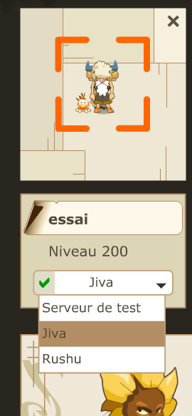
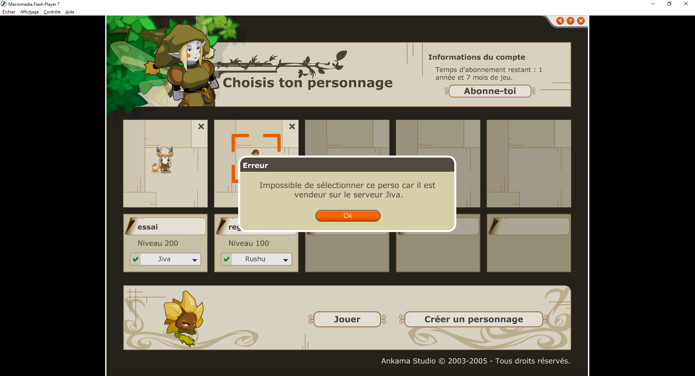
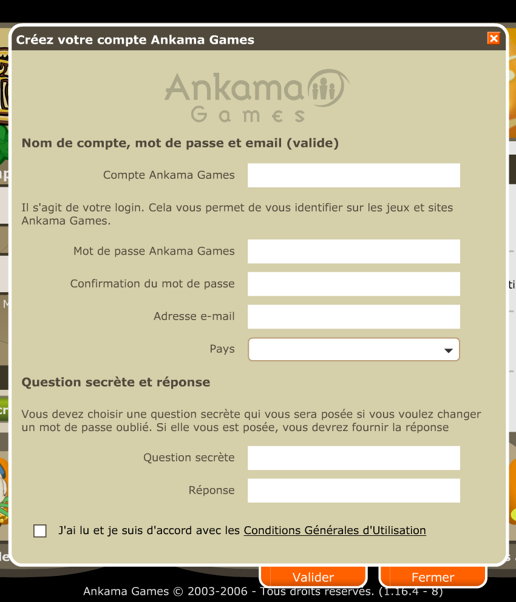
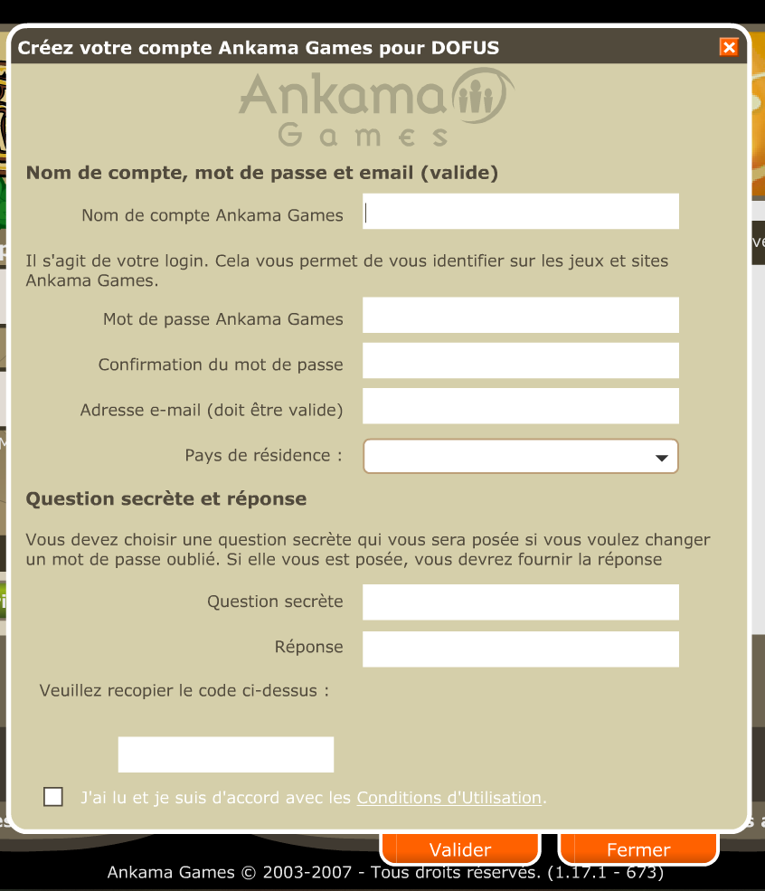
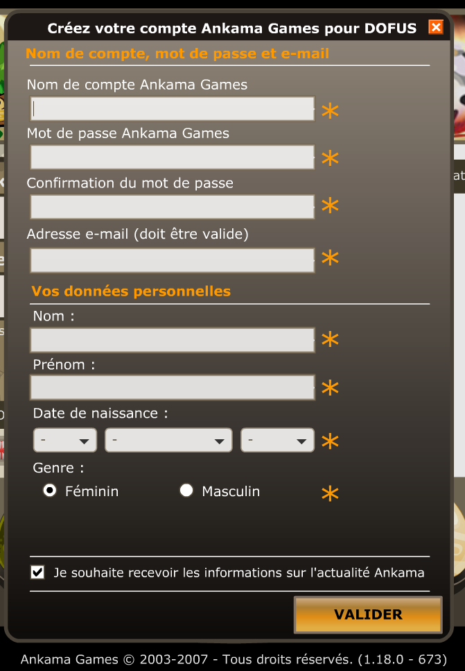

Voici quelques fonctionnalités cachées du client DOfus 1, certaines sont des fonctionnalités intéressantes et qui auraient pu être ajoutées au jeu, d'autres sont beaucoup moins intéressantes. Je vais traiter les fonctionnalités par numéro de version.

> AVERTISSEMENT: Je ne fait que des suppositions sur l'existance et le retrait de ces fonctionnalités, je n'ai aucune information officielle les concernants

## Le choix du serveur de jeu

Lors du passage du client de jeu pour l'adapter à l'utilisation multi serveur, il était prévu de pouvoir choisir le serveur de jeu sur lequel le personnage allait se connecter. A ma connaissance, cette possibilité était présente de dofus 1.9 à Dofus 1.13.1. Pour Dofus 1.9, il s'agit de versions estimée, cette version correspond à la première version officielle en anglais du jeu ainsi que la première serveur à avoir plusieurs serveurs de jeu. Cette version vois également l'apparition d'un serveur de connexion en Java plutot que la connexion via des scripts php (voir l'article Des Premières Beta À Dofus 1.9).  
Cette fonctionnalité était peux être disponible quelques versions avant la version 1.9, pour la dernière version à supporter cette fonctionnalité je pense qu'il s'agit de la version 1.13.1 ou 1.13.2 car la version 1.13.2 a subit une refonte de l'interface de login qui restera jusqu'à dofus 1.29 et je n'ai pas de version 1.13.2 donc je ne peux pas le confirmer, en revanche il est certain que dans dofus 1.14 cette fonctionnalité a été retirée.  
Cette fonctionnalité semble avoir été crée pour faire face à l'affluence de joueurs, le seul serveur de jeu Jiva commençais à ne plus être assez puissant pour accueillir tous les joueurs en simultané, il fallais ouvrir d'autres serveurs de jeu pour accueilir plus de joueurs. Cette fonctionnalité a pu être liée au choix d'architecture du jeu: jusqu'à Dofus 1.13, toutes les données du jeu étaient hébergées sur une seule base de données sur laquelle le serveur de connexion ainsi que le serveur de jeu allais chercher leurs données ([source](https://web.archive.org/web/20071021172436/http://forum.dofus.fr/topic.php?lang=fr&id=38650)), cela explique également la limitation à 5personnages/compte afin de ne pas surcharger la base de données.

### Pourquoi cette fonctionnalité aurais pu être possible

Aujourd'hui (en 2023), les jeux comme World of Warcraft et Guild Wars 2 ont en très grande partie supprimé le problème des serveur en créeant plutot des instances de monde à la place du système de serveurs traditionnel comme l'a garder Dofus. Cependant Dofus possède déja un système similaire avec incarnam où il y a plusieurs incarnams qui sont instanciés en fonction du nombre de joueur.  
Je souhaite également revenir sur la capacité des serveurs de jeu de Dofus, en 2005 je pense qu'il pouvais y avoir entre 1000 et 2000 personnages qui pouvais jouer en même temps sur le serveur de jeu, en décembre 2009 le record est battu avec 200 000 personnes conenctée sur les 47 serveurs de jeu (soit environ 4250 joueurs/serveurs) ([source](https://web.archive.org/web/20100115014015/http://forum.dofus.com/fr/news-f1081/%5Bnews%5D-record-de-connexions-simutanees----battu--t328230.html)). Début 2011 ce record est à nouveau battu ([source](https://web.archive.org/web/20110403202800/http://forum.dofus.com/fr/1081-actualite/441831-nouveau-record-connexions-simultanees-dofus)) avec environ 4300 personnages par serveur. Entre 2017 et 2023 les serveurs ont également été améliorés pour mieux supporter le nombre de personnages, on vois la différence sur des serveurs comme Illyzaelle qui n'ont plus de problème de latence aux heures de fréquentations importantes, j'estime qu'un serveur peux monter jusqu'à 7000/8000 personnes sans avoir de problème, peux être même plus haut. En revenant également dans les versions 1 du jeu, en regardant des postes sur le forum Jol, on se rend compte qu'il y avais déjà des serveurs "morts" avant la 2.0, cette fonctionnalité aurais évité ces problèmes.  

Revenons en 2005, avec les fonctionnalités pouvant poser problème ne sont pas encore intégrées au jeu, il n'y a pas encore les hdv, les seuls éléments qui étais bloquant étais les modes marchand ainsi que la conquête de territoire (je crois quelle était intégré en jeu sans en être sur). Pour les modes marchands il y a des preuves que le problème était prévu. Pour les guildes et liste d'amis, je pense que quelque chose était prevu et surement faisable (pour rappel, toutes les informations sont centralisées sur une seule base de données, il est donc facile de gérer ce qui passe par la base de données mais ce qui est dynamique peux poser problème (amis connecté mais sur un autre serveur, personnage de guilde connecté sur un autre serveur, percepteur lié a un serveur,...)).  

### Les difficultés de la mise en place

Je vois plusieurs limitations qui auraient pu être crées à cause de cette fonctionnalité, comme évoqué juste avant le système d'amis et de guilde. Le temps de réapparition des monstre aurait pu être un problème ainsi que la surcharge de certains éléments comme le nombre de mode marchand sur une carte (ils étaient pensé pour être lié à 1 serveur). Une autre limitation provenais des maisons, pas moyen de les instancier donc elles auraient été liées à un serveur et posais différents problèmes qui étaient gérable mais complique, surtout avec l'ajout de futures fonctionnalités (les enclos privé).  
Lors de la mise à jour 1.10 arrivent les hotels de vente, le problème est que si cette fonctionnalité était en place, que ce serait-il passé? Si les hdv étaient multi serveur, les ressources n'auraient rien couté et l'économie en grande partie détruite. Si les hdv étaient liés à un serveur, on aurait eu un peu comme le cas où Bonta est l'hdv le plus remplis, tous le monde aurait été sur un seul serveur car l'hotel des vente était remplis.  

### Les preuves que cette fonctionnalité était prévue

Voici 2 images qui prouvent que la fonctionnalité était prévue:

Sur cette première image, on vois la possibilité de choisir le serveur de connexion sur Dofus 1.9:

 
 Sur la seconde image, on vois le message d'erreur affiché lorsque le joueur choisi un serveur alors qu'il est en mode marchand sur un autre serveur:

## L'interface d'inscription en jeu

Entre Dofus 1.15 et Dofus 1.18, il était possible de s'inscrire directement depuis le client du jeu. Précision concernant l'arrivée de ceette option, j'annonce la version 1.15 mais il est possible que cette option soit arrivé avec la version 1.14 voir la version 1.13.2 mais je ne possède pas ces clients pour vérifier. A partir de la version 1.19, l'interface est toujours présente mais est désactivée via une nouvelle option qui permet de gérer son activation ou non. La raison de la désactivation n'est pas connue mais je suppose que le problème peux venir de l'utilisation du formulaire d'inscription par des bots ou autre outils. 

Il y a eu 2 versions de cette interface:
- Une première entre de la version 1.15 à 1.17, il s'agit d'une interface avec les éléments classiques de l'interface, à noter qu'un système de captcha a été ajouté avec la version 1.17, cette modification s'explique par l'augmentation du nombre de bots en jeu.
- Une seconde interface est arrivée avec la version 1.18, elle est plus moderne et plus proche de celle qui a été ajoutée au choix de serveur lors de la création de personnage.

Voici les images des 3 versions de cette interface:
> Je ne garanti que ces interfaces sont tels quelles l'étaient à l'époque

La version 1 de l'interface (dofus 1.15/1.16):

La version 1 de l'interface avec le captcha (dofus 1.17):

La version 2 de l'interface (dofus 1.18):

