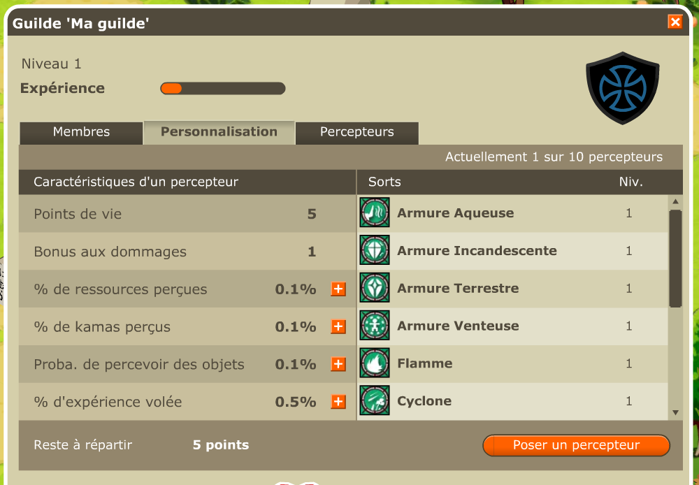

J'ai trouvé très peu de chose sur les premières versions des guildes, alors voici un peu d'explication sur le fonctionnement des débuts des guildes.
Dans l'ensemble, le fonctionnement des le même que celui de dofus 1.29/retro avec du contenu en moins.

## Les informations générales

Le nombre de membre est de 20 + le niveau de la guilde   
La guilde gagne 5 points de boost par niveau  
Le tableau d'xp des guildes est de 100 fois le nombre d'xp nécessaire pour les personnages  
Avant la 1.23:  
Le nombre de percepteur est influé par le niveau de la guilde (à partir de la 1.23, doit être boost)    
Les pdv des percepteurs sont 100 * le niveau de guilde  
Le bonus de dommages des percepteurs correspond au niveau de la guilde  

Les sorts des percepteurs sont:  
- Les sorts de défense : Armure aqueuse, Armure Terrestre, Armure Incandescente, Armure Venteuse.
- Les sorts d'attaque : Rocher, Flamme, Vague, Cyclone.
- Les sorts de soutien : Mot Soignant, Désenvoûtement, Compulsion de masse, Déstabilisation.

## L'interface

Sur Dofus 1.9/1.10 nous avons cette interface:

On remarque qu'il n'y a pas encore l'alignement d'affiché dans l'interface des guildes. Pour le reste, le concept de maison de guilde n'existe pas et le concept d'enclos n'existe pas (logique, ils ont été ajoutés avec la version 1.15).

## L'interface de gestion de membre

La gestion de membre est presque identique à celle de dofus retro, avec des droits en moins et la gestion des rangs qui se fait directement via une liste d'élément plutot qu'une liste déroulante (présente à partir de dofus 1.14 ou 1.15).

## Les rangs

Pour commencer, voici les 8 premiers rangs disponibles sur Dofus jusqu'à Dofus 1.14.2:
Meneur
Bras droit
Trésorier
Protecteur
Artisan
Réserviste
Larbin
A l'essai

A partir de dofus 1.14.2 (septembre 2006), d'autres rangs ont été ajoutés:

Gardien
Eclaireur
Espion
Diplomate
Secrétaire
Assassin
Gouverneur
Muse
Conseiller
Elu
Guide
Mentor
Recruteur
Eleveur
Marchand
Apprenti
A l'essai
Bourreau
Déserteur
Boulet
Pénitent

A partir de dofus 1.17, 6 autres rangs ont été ajoutés:
Tueur de familiers
Traître
Braconnier
Chercheur de trésors
Voleur
Initié

Voici les sources pour les rangs:
- [Forum JOL, liste des rangs originaux](https://web.archive.org/web/20250513181613/https://forums.jeuxonline.info/sujet/474583/rangs-de-la-guilde)
- [Un second lien qui en parle](https://web.archive.org/web/20250513181635/https://forums.jeuxonline.info/sujet/613569/comment-gerer-sa-guilde#post10803768)
- [La liste des rangs sur la 1.14.2](https://web.archive.org/web/20250513183001/https://forums.jeuxonline.info/sujet/709478-2/nouveaux-rangs-guildouniens)
- [Page 1 du sujet précédent](https://web.archive.org/web/20250513183435/https://forums.jeuxonline.info/sujet/709478/nouveaux-rangs-guildouniens)

## L'interface des percepteurs

La version 1.10 a ajouté quelques options sur les percepteurs.
A noté: La feature des Percepteurs a été revue avec la version 1.23, il y a eu le retrait des éléments volés et la transformation par un boost de pp et de dommages.

Interface de la version 1.9:

Interface de la version 1.10:
