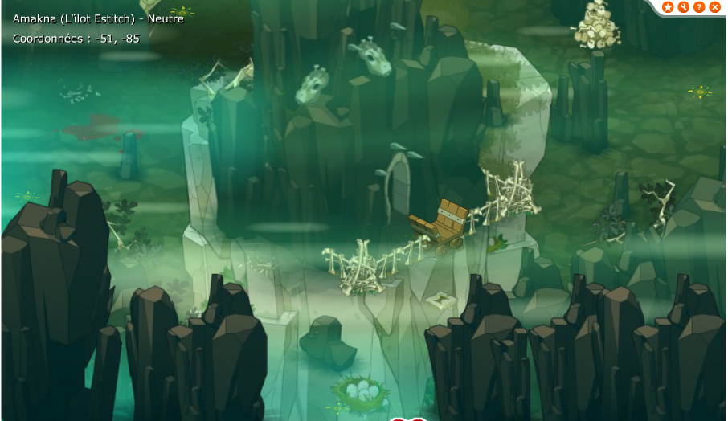
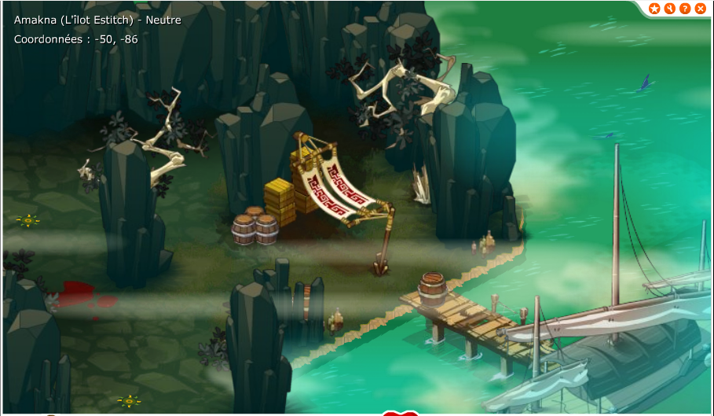
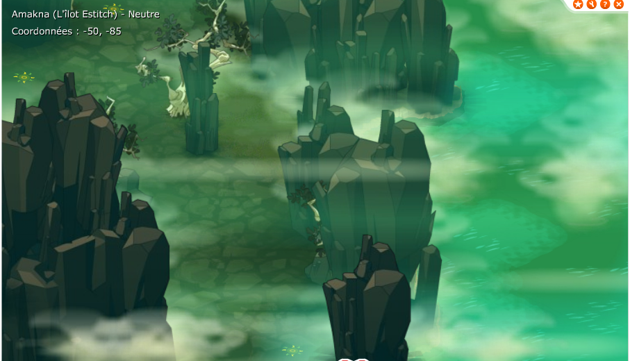
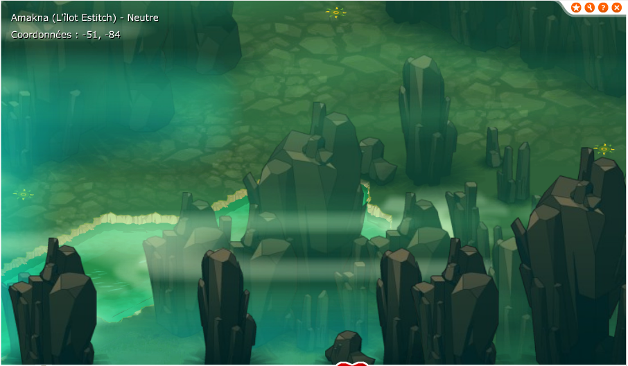
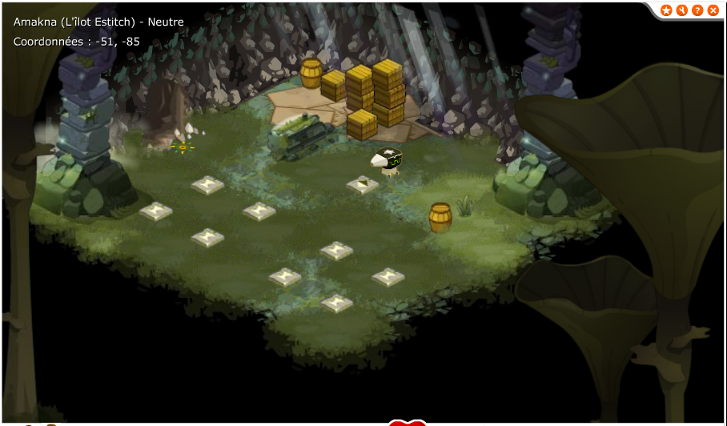

## Les informations de base sur l'ile

Cette ile est "sortie" dans les fichiers du jeu avec la mise à jour 1.24, les cartes de l'ile sont disponible et sur les versions dofus 1.29 et dofus retro, on peux voir les positions de l'ile sur la map du monde lorsque l'on passe la souris dans la zone entre le nord ouest de bonta et l'ile de nowel. Dans les premières versions de dofus 2, l'ile était disponible, elle  a été développée pour dofus 1 et dofus 2.0, avant d'être introduite réellement en jeu avec la refonte et finalisation des quêtes d'alignements.
La version 1.x et la version des débuts de dofus 2.0 de l'ile sont quasiment identique, la version de l'ile actuelle a juste subit une légère modification pour la moderniser.

Certaines informations que l'on lire sur internet évoque le monstre "Pumbaa" qui serait un monstre de l'ile, cependant ce monstre est listé dans la zone des plaines herbeuses d'otomai, le monstre n'a donc aucun lien avec l'ilot estitch. [Source](https://www.dofus.com/fr/forum/1003-divers/1932436-legendes-mysteres-dofus?sort=rate_D&page=1)(Voir la réponse de Korri en bas de page)

## Les cartes
La sous zone ilot estitch existe, les id des maps vont de 12151 à 12159 pour l'extérieur et de 12164 à 12166 pour les cartes intérieures.

Et la "grotte" intérieure de l'ile:  

## Les suppositions

- Comme beaucoup de contenu ajouté entre les version 1.21 et 1.29, il s'agit du contenu prévu pour les quêtes d'alignement.  
- Depuis les premières versions de Dofus (avec l'apparition des quêtes d'alignements), il était prévu de termienr les quêtes alignements de manière prioritaire, mais Dofus 2.0 a été mis en développement laissant ce contenu réaliser par les graphistes prêt à sortir mais jamais terminé. Les quêtes d'alignement étaient surement déja imaginées également. On peux associer cette zone à d'autres zones comme les donjons d'ilyzaelle et de ku'tan mais aussi beaucoup de maps et zones comme le sanctuaire d'hotomani et la zone sud ouest de brakmar. Le déploiement plus rapide que prévu de dofus 2.0 a enclenché le développement de frigost plutot que terminer la sortie des quêtes d'alignement.  
- La ressemblance de cette version avec l'ile ressortie officielent sur Dofus 2.0 montre que la refonte des quêtes alignements a repris une partie du contenu d'origine des quêtes alignement.

## Divers liens / sources
[Un sujet du forum officiel.](https://www.dofus.com/fr/forum/1003-divers/1932436-legendes-mysteres-dofus?sort=rate_D&page=1)  
[Un autre sujet du forum officiel.](https://www.dofus.com/fr/forum/1807-monocomptes/2353772-ilot-estitch-spoil-secret-bien-garde)  
[Un sujet d'un blog.](https://loleyke.skyrock.com/3249742416-Hors-serie-Un-article-un-peu-special.html)  