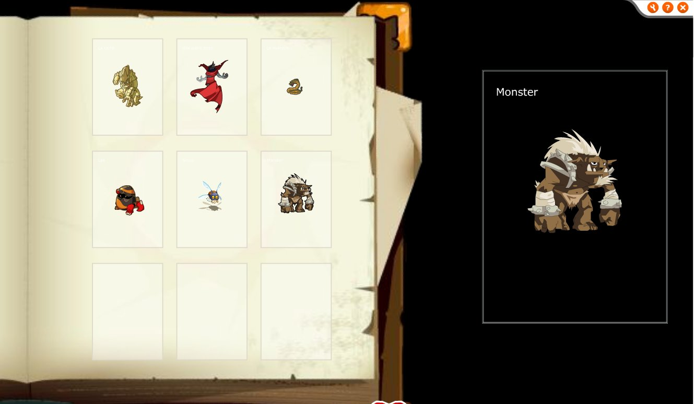
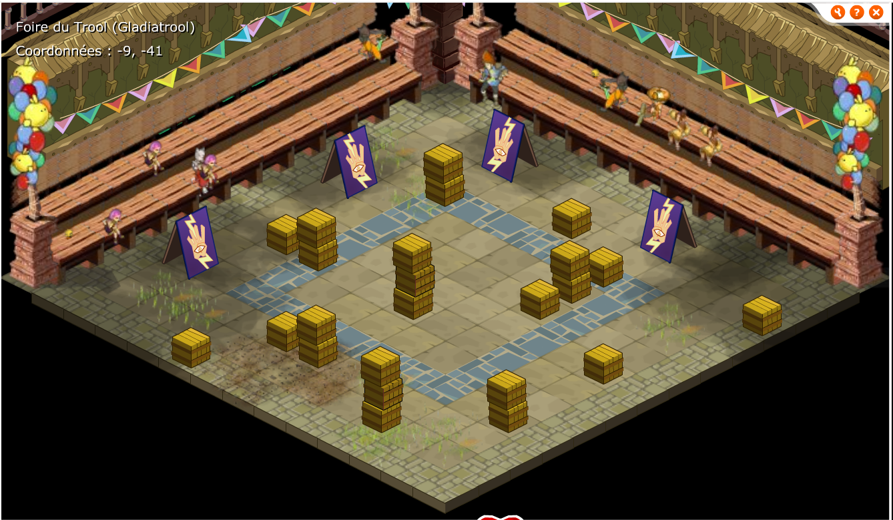

Les 2 principales nouveautés de Dofus rétro 1.39 n'étaient pas nouvelles, elles dates en réalité de 2004 et ont été ajoutées au jeu partiellement en début 2005.

## La collection de carte (TTG)

Il n'y a pas grand choses à sur cet élément, il s'agit du jeu de carte ajouté avec la mise à jour 1.39. L'interface est présente dans le client au moins depuis la version 1.9 (septembre 2005) et probablement disponible depuis la sortie de la zone Cania. L'interface est très partiel et a servie de base pour celle de la version 1.39, elle n'est même pas du tout terminée, à noter que les cartes étaient prêtes.

Voici une image de l'interface:

## Le gladiatrool

Le gladiatrool semblais lui aussi présent, comme la collection de carte, cette foncitonnalité a été évoquée dans différentes interview, l'idée semble similaire à celle qui a été ajoutée avec la mise à jour 1.39. 
Il y a quelques cartes d'intégrées au client, elles sont quasiment identique, les seules modifications sont le public et les obstacle sur la partie jeu.

Voici une carte prévue:

Liens intéressants:
- [Les pnj de la foire du trool et ce qu'ils permettent de faire](https://web.archive.org/web/20230327190253/https://children-of-dofus.xooit.com/t226-La-Foire-du-Trool.htm), le gladiatrool y est déja évoqué.
- [Un sujet du forum dofus jeuxonline](https://web.archive.org/web/20230327190200/https://forums.jeuxonline.info/sujet/820394/foire-du-trool-gladiatrool), évoque le gladiatrool en 2007.
- [Un autre sujet du forum jeuxonline](https://web.archive.org/web/20230327185745/https://forums.jeuxonline.info/sujet/690771/regroupement-d-info-officielles-quoi-de-neuf-pour-la-prochaine-grosse-mise-a-jour), dans la première réponde qui date du 8 septembre 2005, il est déja question du gladiatrool qui semblais prévus depuis un moment.