> Information importante:  
> La plupart des skins sont en réalités utilisés dans le jeu. Je laisse cette pas telle quelle mais certains éléments sont faux.

# Analyse des monstres présents dans les fichiers du jeu.
## Informations  
Je vais faire une sorte d'analyse du fichier Sprites.xml et de lecture des sprites (swf) de la version 1.16 de dofus 1, ce fichier contient beaucoup de nom de monstres ainsi que leurs id, cependant, certains monstres n'ont pas tout à fait le même nom que leurs noms définitif en jeu.

## Les monstres avec des skins
---
On va commencer avec un monstre plus ou moins connu, je sais qu'il a déja été montré, il s'agit du "gros démon sur son canap", c'est un démon sur le trone d'ogivol, il s'agit du monstre Uk qui a servi pour un évènement.
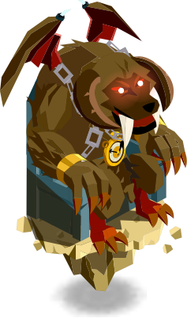  

Le second est également surement connus, il s'agit d'un boufton debout. Ce monstre est surement utilisé dans la foire du trooll ou dans un coin bouftou. Il s'appel Bouftou GM (pour guildmaster ou génétiquement modifié comme le wabbit GM?), il semble pouvoir combattre car il a une animation de CC.  
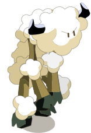  

Le papa nowel maintenant, ici il ne s'appel pas papa nowel mais popy nouel, il s'agit du jeu de mot de base du monstre. Après vérification, il s'agit finalement du minotoboule de nowel 
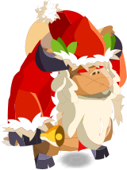

Le KillBoul, il s'agit probablement de l'ancienne version du Qil Bil, bien plus travaillé que le qil bil actuel...  
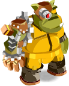

Un monstre inconnu, surement prévu pour une zone plage.  
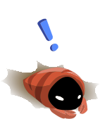

Un bernard l'hermitte, surement prévu pour une zone plage.  
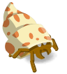

On peux trouver toute une famille de trool, je suppose qu'il devais y avoir, comme il y a eu avec la refonte de cania en 2.0, toute une catégories trool.
le trool barbu:  
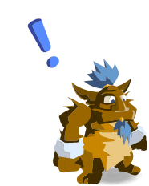

La maman trool:  
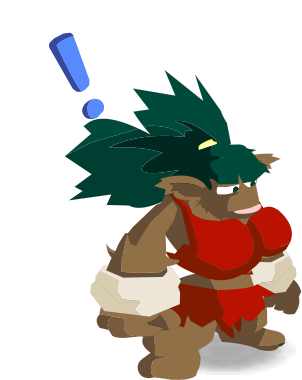

le bébé trool, ressemble a une mascotte d'une marque?  
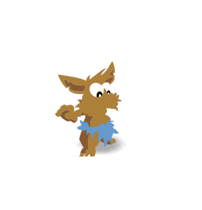

Une sorte d'ébauche du yech'ti? le monstre n'a pas de nom mais existe!  
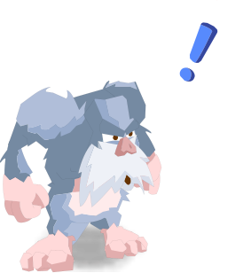

La première version pottentielle des abrakleurs?, il s'agit du krakeleur sombre (les craqueleurs sont nommés krakeleur)  
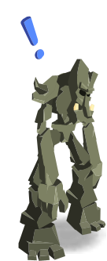

Un petit sprite fun, je suppose qu'il devait être la dans un combat, peux etre en boss avec le mob l'éponge?  

Le mob l'éponge original? Il s'agit plus d'une gelée citron que du mob l'éponge   
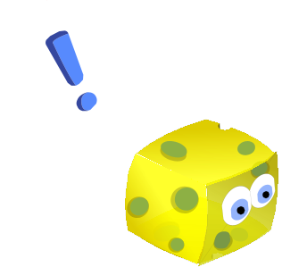

Un lutin, il est nommé Le Lutin Irlandais, surement pour un event saint patrick.  
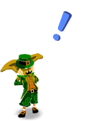

Le célèbre péki garou qui devais être ajouté dans son donjon? (tout étais prêt, le péki péki apparaissait sur l'ile de grobe, probablement un peu comme d'autres monstres, en tant que boss).  
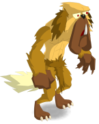

Le boss des plantes, il s'agit du tournesol affamé. (A confirmer, il s'agit peux être d'un ancien skin)  
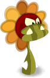

Peux être la première version du sphincter cell, à noter qu'ici, le nom est splinter, le nom vraiment copier de la référence à splinter cell.  
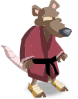

Une monture diforme, semble avoir fortement inspiré les dragodindes, le drakoalak utilise peux être ce sprite.  
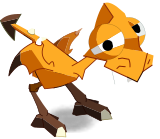

Le tofu transgénique, un tofu malade, était peux être implanté?  
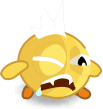

Un champa maitre bolet, l'avis de recherche implanté en 2.0 aurais du ressembler a ca plutot que reprendre le sprite du maitre bolet...  
Nom: champobolet  
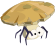

Le pepsykoalak, non implanté à ma connaissance:  

Sprites liés à la foire du trool, ils sont surement utilisés pour la décoration de la zone:  
BouftonCus-longiformus:  
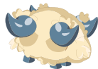

BouftonCus-Quadricornus (visible à la foire du trool):  
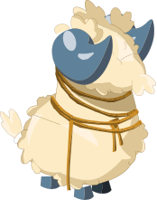

Bworkitus-double tetus (visible à la foire du trool):  
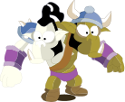

---
## Les information textuelles
Je vais juste les écrires lignes par ligne en détaillant un peu.

- L'épée dansante du sacrieur était présente, c'est un ancien sort sacrieur (avant la dissolution)
- Le kralamour est présent dans la version 1.13, soit bien avant la sortie d'otomai
- Le mob l'éponge à pour nom de base bob la mOusse
- les craqueleurs était appelés krakeleur
- les craqueboules était appelé krak'boule
- Il devait y avoir un craqueboule des plaines
- On trouve un Dark Démino qui est un déminoboule tout noir.
- Padgref s'appelais padegref
- Noel, nowel actuellement, était appelé nouel
- Les firefoux était appelé Firefox
- La transformation du firefoux était appelé méga renard
- Les bworks était appelés ORC
- Les cra femelles sont des craettes
- Le nom de base de la famille pichon est requin, les pichons ont eu 2 skin: 1 avec un anneau sur le dos, 1 sans l'anneau. Le raul mops devais également s'appelé requin
- Il y a 2 moumoules: une ouverte, l'autre fermée
- Les maitres koalak ont pour nom Papy Koalak
- Les koalak indigo ont pour nom kokakoala (coca cola)
- Par opposition au kokakoala il y a le pepsykoala
- Le nom du koulosse est Cooloss
- Le boufcool est nommé bouftou arc en ciel
- Le bouftou des cavernes est nommé bouftout des montagnes
- Les bouftou sont appelé boutfout (bouf tout)
- La dragoune est appelée dragoon

- On trouve un moskito bleu
- Le minotot est appelé MinoTot (si mino = enfant, minoTot = enfant de tot?)
- Les Kaméléon et salamandre de l'ile minotot devaient exister en bleu/vert/rouge/bleu, comme les gelées et blops
- Le tofu royal est nommé ôTofu (ro i Tofu), possible mot japonnais?
- Chaque classe à son champion? prédécesseurs des dopeuls de temple?
- Le Meulou est nommé meuhloup et le milimulou mimimuloup
- Un fantome de familier petite gelée semble exister. Remplacer par le bilby?
- Un fantome de Tortue semble exister, remplacer par l'atouin?
- Un fantome de Nomoon existe, il est appelé Moon.
- Les familiers bwak sont appelés kwak.
- Il y a un fantome de piou, le skin est le même que les piou et différent des pioutes.
- Le koalak sanguin était le koalak.
- Le bworky = Mini bwork.
- Un fantome de koala, basé plus ou moins sur le skin koalak immature est présent.
- Le tifoux était le mini Foux / mini Fox.
