## Introduction

Lors de recherches sur le fonctionnement des documents je suis tombé sur des avis de recherche qui n'ont jamais été ajouté ou qui ont grandement été modifiés qui permettent de retracer la création du système des avis de recherche et indirectement de la modification du système de gestion des documents avec les parchemins d'avis de recherche. Cette modification semble avoir été ajoutée avec la mise à jour d'Astrub (dofus 1.10), ce qui correspond à l'ajout du système de journal de quête ainsi qu'à l'ajout des avis de recherche.  

Tous les screens utilisés ont été réalisés sur une version 1.16.2 du client avec les fichiers originaux de cette version.

### Les documents avant dofus 1.10

Ce système est toujours présent aujourd'hui sur dofus rétro. Au moment des premières versions 1 du jeu on trouve 2 types de documents: les livres et les panneaux. Les panneaux servent à indiquer les lieux aux joueurs, il sont un peu partout sur la carte. Pour les livres ils ont été ajouté pour permettre d'ajouter des histoires mais ils ont également été imaginés pour les métiers, par exemple les livres devaient permettre de voir les recettes des métiers (potion d'oubli de sort pour les Alchimistes), ce système n'a finalement jamais été retenu.  

### Dofus 1.10  et l'avis de recherche de Padgref Demoel

Avec Dofus 1.10, le système de quête est modifié: désormais les quêtes ne seront plus de simples dialogues avec des pnj et des échanges (quête des parchemins de caractéristique par exemple). Une interface de quête sera ajoutée pour permettre un suivi et les pnj qui proposent des quêtes seront reconnaissables grâce à un point d'exclamation au dessus de leur tête. Les avis de recherche auront un autre système de déclenchement de quête: il faudra passer par des parchemins qui ont été crées pour l'occasion et qui permettrons de démarrer des quêtes.  

Avant de penser aux parchemins, il y a eu des essais sur des livres avec l'avis de recherche de Padgref:
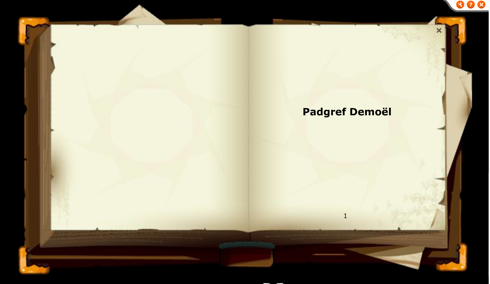
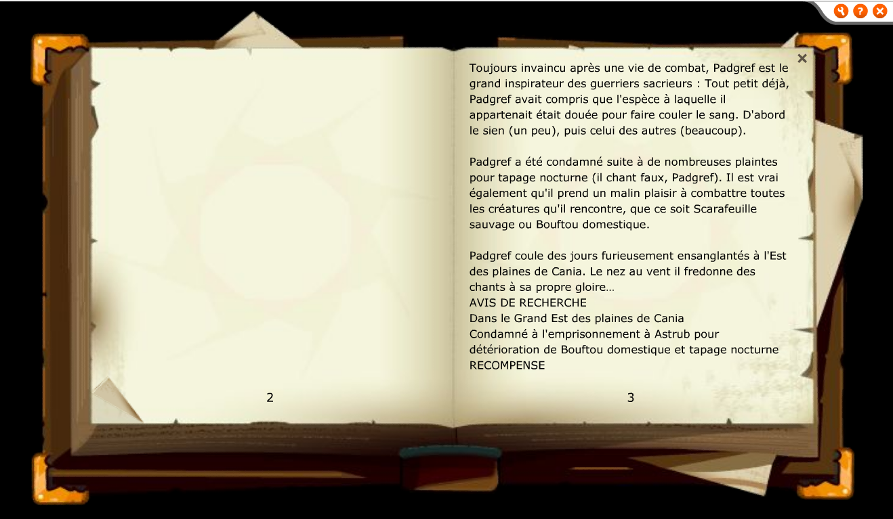

En même temps, il semble y avoir eu des test avec un parchemin:
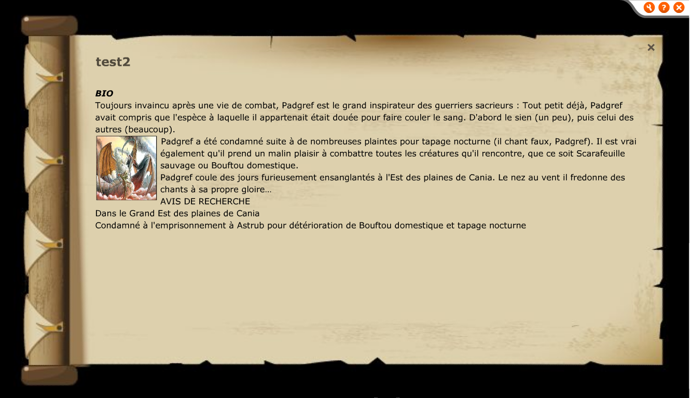

Une version plus avancée qui aurais pu sortir en jeu est également présent:
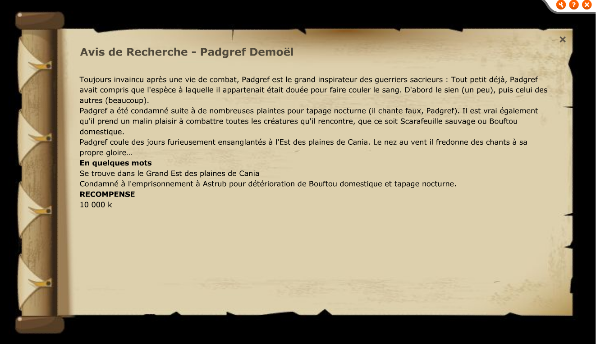

La version définitive de l'avis de recherche:
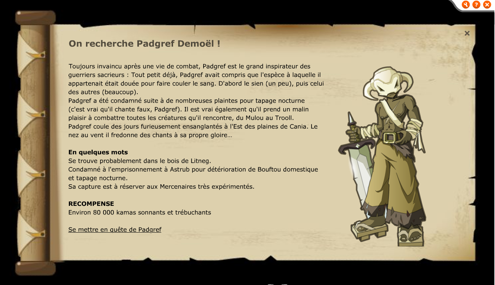

Elements à noter: Sa position indiquée est différente de la version finale, il est indiqué dans l'est des plaines de cania, cependant sa version finale est dans le bois de litneg qui n'est pas à l'est des plaines de cania. La version définitive de l'avis de recherche y fait toujours mention. Le gain en kamas est également bien plus faible.

## Les 3 bandits de Cania

Un avis de recherche sur les bandits de Cania à été préparé, chose notable: même si les 3 bandits ont un skin, l'image utilisée sur l'avis de recherche est celle de Padgref, preuve que l'avis de recherche est resté en WIP.

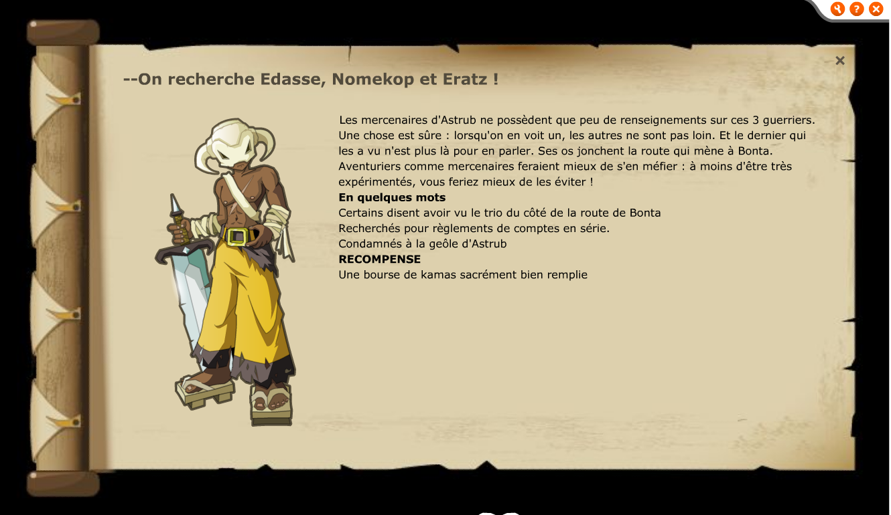

## Nervoes Brakdoun

Un avis de recherche très intéressant!

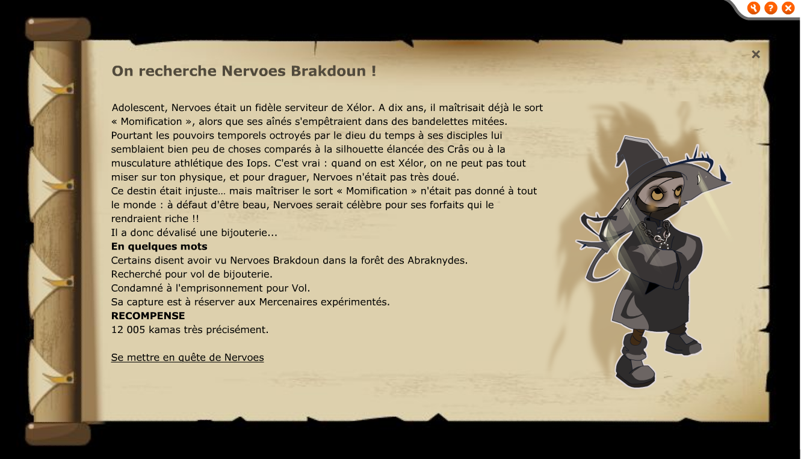

Son ajout au jeu semble avoir été prévue au moment de l'ajout d'Astrub mais il n'est jamais sorti officiellement en jeu. Son skin est celui du Xelor totalement gris, autrement il semble plutot prêt mais n'a jamais été sorti, peux être à cause de sorts bug.

Même si il n'a jamais été implanté, cet vis de recherche n'a pas été retiré lors du passage à la version 2.0, voici ses skins en version 2.0:  
**Version monstre:**  
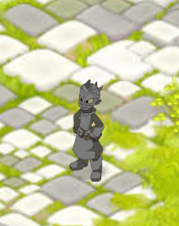  

**Version PNJ (Attention avec cette version: elle proviens de la version 2.6.2 et je ne suis pas sur quelle soit à 100% officielle):**  
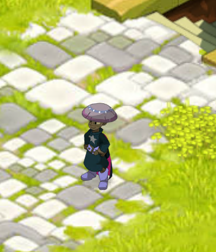  

## Léthaline Sigisbul 

Cet avis de recherche n'en est pas vraiment un, Léthaline n'a été présente que pendant l'évènement d'Uk'Not'Allag le 26 avril 2006. Une chose surprenante est que le fichier a été généré le 24 avril 2006 soit 2 jours avant l'évènement.

Voici son avis de recherche original, la version de dofus retro a été légèrement modifiée:
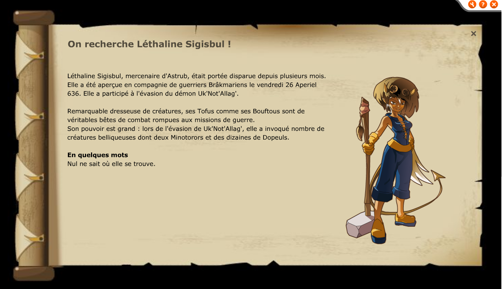

## Les 3 chafers

Il n'y a aucune autre information sur cet avis de recherche, il semblais être prévu pour Astrub. Peux être qu'il s'agit d'une version alternative des bandits de cania?

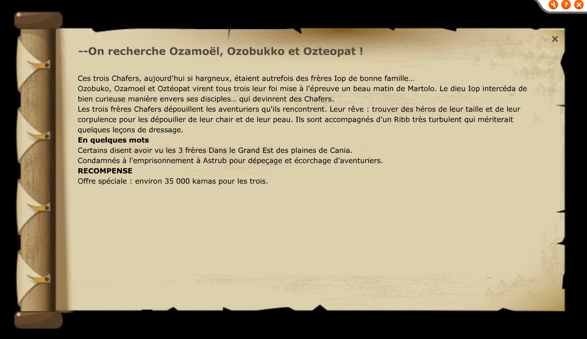

