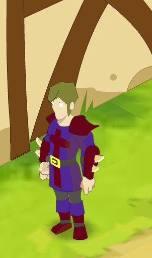

# Annecdotes sur Dofus 1.9.1

Ayant pu avoir accès à l'interface de dofus 1.9.1 , j'ai remarqué quelques différences avec les clients des version supérieures.

Pour la suite, je me suis surtout intéressé au iop, en fonction des classes, la plupart sont déja comme elles sont sur la version 1.29/retro.
On remarque d'abord que le iop possède son ancien skin, les cheveux ne sont pas en l'air sur sa tête (dans l'interface de création de personnage, il s'agit bien du iop avec les cheveux long):

Ensuite, en affichant son portrait dans le médaillon au centre en bas, on remarque un animation des yeux qui clignent, cette animation est disponible surtout pour les skin males et pas pour toutes les classes:

Enfin, l'interface pour faire évoluer les sorts, elle est radicalement différente de ce qu'on trouve dans dofus 1.29/rétro, j'ignore quand cette interface à été modifiée pour être cette que l'on connais sur dofus retro:

Personnelement je trouve cette interface plus intéressante: lorsque l'on glisse un sort pour l'améliorer, il est possible d'avoir une prévisualisation de ce qui va changer pour le sort, je ne comprend pas vraiment pourquoi cette prévisu à été retirée. Cette interface pose également un problème: le personnage ne peux avoir que 20 sorts de chaque types.