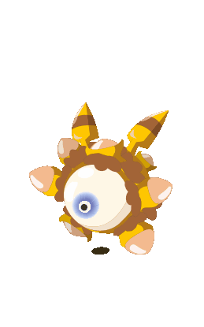
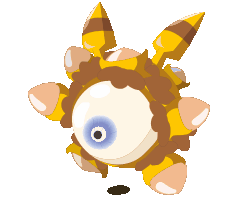

## 1. Le Bitolder et les fichiers du jeu

Des références à ce monstre sont présentes à différents endroits:
    - Dans les "langs", dans la version française il est nommé bitolder, il est encore présent dans la version 1.39 de dofus rétro.
    - Dans le fichier sprite.xml (présent à partie de la 1.16), il est appelé BITEHOLDER. Il est supprimé de ce fichier dans les dernières version de la version 1 du jeu (à partir de la version 1.21). Le nom biteholder pourrais être le jeu de mot de base du bitolder avant d'être revu pour être plus correct.

### Le fichier sprite du Bitolder

Le bitolder est présent dans les sprites du jeu de la version 1.9.1, il est possible que le sprite ai été présent dans plusieurs versions avant ou après cette version cependant je ne pas pas le confirmé (il n'est pas présent dans la 1.13).   
Le fichier se nomme: 1094.swf et est dans le dossier /clips/sprites/ du jeu, le fichier à été crée pour flash player 7. La beta 17b s'arrête au sprite 1088 et la version suivante qui est la 1.0 possède un sprite 1095, le bitolder semble avoir été prévu pour la version 1.0 mais il a été retiré pour la sortie officielle (c'est le cas pour très peu de montre connu).  
Dans la version 1.9.1, le fichier a été recompilé le 7 février 2005 soit pour la sortie de la version 1.5, le fichier a pour destination flash player 7, la première version du monstre devait être à destination de flash player 6 (voir 5) pour être compatible avec les anciennes versions du jeu (cf: sprites 1088 et 1095 des versions 1.0 et 1.9.1 qui sont en version swf 6 puis 7). La première apparition du fichier du bitolder est peux être la version 1.5 et il a été supprimé entre la version 1.9.1 et 1.13.0 lors du passage à flash player 8 à l'occasion d'un nettoyage des sprites du jeu.

Il est possible que les animations de sort du monstre soient présentes ici et intégrées à sont sprite. Il semble y avoir 2 versions: 
- Une sans oreilles
- Une avec des oreilles à la manière de pikachu

  
  
  
  
  
  
  
  
 

Enfin, peux être son sort ou une animation:  
 

Le fichier est surement mal compilé, le monstre n'a qu'une orientation de disponible et le fichier possedé n'est pas le fichier original, il est compilé pour flash 7 tandis que Dofus 1.0 utilise des sprites en Flash 6.  

Note: lorsque le client charge l'apparence du bitolder, il n'y a rien qui apparait, le fichier est peux être corrompu ou non fonctionnel à cause de la version de flash player utilisée.

## 2. Ses informations  

Ses caractéristiques sont disponible ici: https://dofuswiki.fandom.com/wiki/Bitolder ( et il me semble sur un autre site avec son image mais je n'ai plus le lien).
Infos extrait des fichiers:
- id: 151 (comme le premier pokemon) ( l'id 150 est le Noeul, monstre qui lui ressemble un peu)
- gfxid (sprite): 1094
- le monstre a 6 "niveaux", à chaque fois il est lvl 100
- les resistances du wiki fandom semblent correctes:  
  - 25% neutre, 10% terre, 40% feu, 30% air et eau
  - les résistances feu: 40%,400%,760%,1120%,1480%
- Le nom anglais du monstre semble également le bitolder.

Le monstre n'a pas d'artwork qui s'affiche lorsque c'est a son tour de jouer et il n'a également aucune ressource associée.
Il est dans la catégorie monstres divers / Boss et il semble pouvoir drop des pierres précieuses (diamant, emeraude, rubis, cristal)(cf: solomonk.fr le bestiaire et le dofus wiki fandom).

## 3. Son sort  

A ma connaissance, c'est son seul sort, il s'appel Teubatak et son id est 237. Le nom anglais est également Teubatak, il ne semble pas avoir d'animation et le sort ne semble pas équilibré, il s'agit probablement d'un sort de test ou crée par amusement.

Voici les détails de son sort:  
  

A mon avis, l'id du sort du bitolder (237) est intéressant, les id des sorts des 10 premières classes vont de 1 à 200, il ne s'agirait donc que du 37ième sort lié à un monstre ce qui le placerait dans les sorts crées avec les premiers monstres (soit au moment des toutes premières beta (avant la v11b), soit au moment des betas v14b/v15b, après la création des sorts des crabes mais avant la création des sorts de l'Abraknyde Ancestral et des monstres de la zone cimetière d'Amakna).

## 4. Sa carte supposée: La grotte de loopine  
 
Infos de la carte où il est supposé qu'il devait apparaitre:
- mapid: 1567
- coordonnées: 2,17
- capabilities: 15 (on ne peux rien faire sur cette carte)
- La carte semble exister depuis la v17b, cette information est impossible à confirmer mais elle pourrais être liée à la modification de la carte de la grotte de Loupine.

Voici la carte sur laquelle devait être le bitolder (il s'agit d'une version de mai 2005):

La carte est une grotte, similaire à celle qui abritait le dragon cochon et les murs sont fonctionnels mais il y a une possibilité de se déplacer sur les cases noires derrière les murs de la carte.

Les éléments interessants de la carte:
- La carte est sur le même thème que les autres grottes
- Elle est très grande par rapport aux autres grottes.
- Beaucoup d'éléments de squelettes.
- Aucune mention nommée Grotte de Loopine.

La carte n'existe plus dans les versions 1.20, elle semble avoir été retirée du client, tout comme le bitolder. La carte est réapparue avec la version 1.38 de dofus retro dans une version corrigée (il n'est plus possible de marcher sur certaines cases noires), sa sous-zone a changée pour être intégrée à la sous-zone sous terrain mystérieux qui contient les cartes des émotes ainsi que les cartes d'autres sous terrains. La première version disponible de cette carte date de mai 2005 (version 1.7), elle a peux être des versions encore plus anciennes. 

## 5. La carte de l'entrée de la grotte  

En regardant la carte du monde (géoposition) de dofus retro, on vois sur la carte aux coordonnées 2,17 qu'il y a une petite icone qui symbolise une grotte, cette icone était auparavant une maison, elle a probablement été changée lors de la mise en place de l'interface de géoposition. Voici quelques explications sur l'histoire de la carte:  
La carte présente sur Dofus rétro est bien celle de la version 1.0 mais si on regarde [ici](https://web.archive.org/web/20040808030022/http://ophmialeen.free.fr:80/map.htm) et [ici](https://web.archive.org/web/20161017180243im_/http://ophmialeen.free.fr/MapDofusQM/1024.jpg) (une map interactive des premières versions du jeu), on remarque que sur la carte de la version beta 16b, il y a une maison appelée "La maison Arbre", lorsque l'on regarde le site de la carte "intéractive", la sauvegarde du site des 5 et 8 aout 2004 (dates de la beta 17, la version 1.0 étant sortie fin aout) montrent que la maison arbre est désormais le futur atelier alchimiste en 1,16 et qu'il y a désormais une grotte avec un pnj (Loopine) devant.  
L'autre preuve en provenance du client du jeu est que sur la carte du monde de la version 1.0, avant la sortie de l'interface de géoposition la carte était dans un livre et sur la map en 2,17 il y avais une maison. Cette maison à été remplacée par une grotte lors de la mise en place de l'interface de géoposition (lors de la [version 1.5](https://web.archive.org/web/20050228173433/http://www.dofus.com/index.php?page=news&rubrique=v1.5.0&contenu=v1.5.0)). L'icone de la maison n'a pas été déplacé sur la nouvelle carte de la maison arbre ensuite située en 1,16. 

Pour la maison arbre, elle est évoquée [sur ce sujet](https://web.archive.org/web/20040803094025/http://forum.dofus.com:80/Autres/Divers/111619-MaisonArbre), le sujet date de la v16b, juste avant quelle change de carte. Il est possible que la maison n'avais pas d'intérieur et que la mise à jour 1.4 l'a rendue utile en ajoutant les ateliers alchimiste.  

Quelques supposition sur l'emplacement de la grotte:
- L'orientation de la grotte en direction du labyrinthe Dark Vlad pourrais indiquer un passage sous terrain, il pourrait y avoir un lien avec la mine de Ded Aleïcar. L'icone de la grotte indiquée sur la carte après la version 1.5 semble symboliser une mine ou un passage sous terrain.
- Cette grotte à pu être pensée pour abriter un boss à la manière de la grotte du dragon cochon, ce boss aurait été le bitolder.  
- Elle aurait aussi peux être pu être crée pour abriter un coffre comme celui des dalles DOFUS ou ceux des cartes aux trésors des mineurs. Aujourd'hui, les cartes de grottes qui contenaient des coffres ont été modifiées, le coffre est remplacé par un Mulou (voir la grotte en 4,28 ainsi que la grotte des dalles DOFUS).
 
La grotte est apparue avec la v17b, je me demande pourquoi remplacer la maison arbre par autre chose, surtout qu'il était possible de placer la grotte ailleurs, sauf si quelque chose d'autre étais prévu.

## 6. Loopine

Loopine a été mis en place dans la version 17b. Il semble que cette version a ajouté les parchemins de caractéristiques, un bug lié a cet ajout est évoqué dans [un message du changelog de la beta v17.2b](https://web.archive.org/web/20040817025604/http://forum.dofus.com/CarnetBord/Dev/121065-ReV172bCorrectionsApporteesSuite). Le métier et le pnj Forgeron sont arrivés avec la beta v15b. Loopine possède le skin du pnj forgeron, il semble avoir été ajouté et crée pour la mise en place de quêtes d'obtention de parchemin.  

Il se pourrais que Loopine soit le pseudo d'un ancien dev. Le pnj à pu être placé la pour permettre l'entrée dans la grotte via une future quête en plus de l'échange de parchemin. Pour rappel, les quêtes dans les moments de dofus 1.0 sont par exemple échanger des ressources contre un parchemin de caractéristique ou un équipement.
Le dialogue de pnj semble être lié à un lore autour de l'agence touriste et d'Hanniboul Smisse, le dialogue d'Hanniboul Smisse semble faire pensé qu'une quête sur l'agence touriste était envisagée mais finalement jamais sortie.

## 7. Ma première supposition

Je pense que le bitolder a été crée dans les moments de la beta au moment du rush de création des monstres pour les beta après la v12b, il semble avoir été crée très tot dans le développement et une grande partie de l'histoire du monstre semble avoir été crée autour de l'agence touriste. Surement pour des raisons de temps de développement, bien qu'il ai été crée et prêt pour les dernières beta, il étais prévu pour la version 1.0, peux être qu'il s'agissait d'un monstre pour le labyrinthe Dark Vlad. Cependant je pense que le sprite était corrompu ou incomplet et il n'a pas pu sortir, cependant au moment de la recompilation des sprites pour flash 7, il est possible qu'il ai été ajouté aux fichiers du client par inatention que qu'il y soit resté pendant plusieurs versions avant d'être retiré lors du passage du client à Flash 8. Le monstre aurait donc été retiré car non fonctionnel et inutile. J'ai également supposé qu'il aurais pu s'agir d'un pnj mais ce n'est pas possible, le monstre a un sort, des points de vie et des résistances.

## 8. Une supposition que je pense fortement possible

Le lien du monstre par rapport au noeul pourrais provenir de sa création pour les toutes premières beta (peux être même avant), la manière de gérer le sprite est proche des premières beta (pas de coup critique) alors que les monstres de la v17b possèdent des coups critiques. Dans ce cas, le monstre aurais été crée avant la modification des numéros de sprite de monstres et il serait bien plus vieux que ce qu'on pense, Tot évoque [dans cette interview](https://youtu.be/KKbyv05FeNE?t=265) une nuit blanche de création d'éléments humoristique pour le jeu, il n'y a aucune date précise mais il se peux que le bitolder soit issu de ce moment.  
Le fichier a peux être été tenté d'être modifié pour être compatible avec les versions utilisant flash 6 puis 7 du jeu mais sans réussite.  
Cette théorie me semble largement possible mais si elle vraie, le bitolder proviens peux être d'un autre jeu flash d'ankama ou d'une version alpha du jeu voir même du projet Duel et dans ce cas, le Bitolder pourrais être lié au Moon blanc et à d'autres monstres.  
J'ai également remarqué que les monstres sont ajoutés au compte goutte, ce qui veux dire que si le bitolder a été à un moment imaginé et son id a été défini, il ne peux pas s'agir d'un placeholder mais il a bel et bien été pensé pour sortir. Comme je l'ai dit, il s'agit peux être d'un très ancien sprite qui a été tenté d'être mis à jour vers flash 6 puis 7 sans succès, ce qui expliquerai sa présence puis sa suppression.

## La suite

Pour continuer les recherches, je pense qu'il faudrais:
- Rechercher des infos sur la map de la maison de l'arbre avant sont déplacement (avant la v17b)
- Pour continuer les recherches/tests il me faudrais des versions du jeu comprises entre dofus 1.1 et 1.9.0, la version 1.5.0 me semble la plus intéressante car il s'agit de celle qui à du mettre fin à l'utilisation de flash 6 et donc la version dans laquelle le bitolder aurait été ajouté.
- Il me manque également le fichier qui contient l'interface de connexion des beta / des premières versions de dofus 1.x qui pourraient permettre de voir si le bitolder s'afficherai.
- Avoir une version 1.14 "complète" permettrait peux être de mettre la main sur d'ancienne carte (en supposant que toutes les cartes aient été ajoutées à la 1.14 sans être triées)

## Les références au bitolder dans Dofus

Merci à Liche qui fait des vidéos sur le sujet et qui en a parler. [Voir sa vidéo](https://www.youtube.com/watch?v=ag4wu9x4Pgs)

- Au timecode 2:48, le pnj Sbab fait référence aux bitolder.
- Au timecode 3:23, le pnj Philémy Barthémon évoque également le bitolder.
- Un bitolder serait présent dans la base des justiciers, emprisonné.

## CHANGELOG:

1/01/2023: refonte de l'article et simplification pour éviter les répétitions et ajout des parties sur mes suppositions
26/12/2022: Modification sur Loopine
04/11/2022: Ajout des informations sur les modifications de la carte de la grotte  
03/11/2022: grosse modifications sur les théories suite à la découverte de la v17b  
30/05/2021 : Mise à jour "finale" de l'article, sauf si un jour j'arrive à récuperer une version beta 17b, il est actuellement impossible d'aller chercher plus d'élément et de connaitre plus d'éléments.  
12/03/2021 : Ajout dans la conclusion d'une partie sur l'id du sort.  