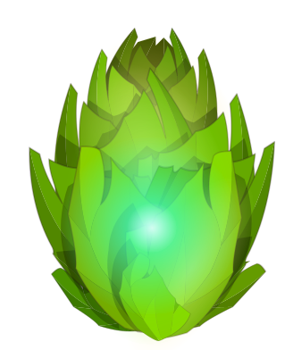
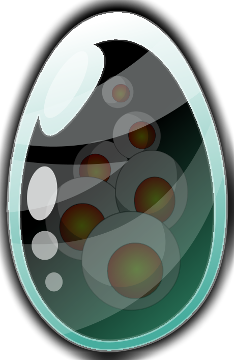
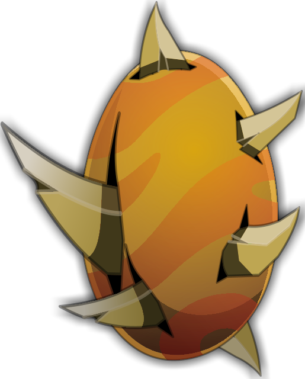
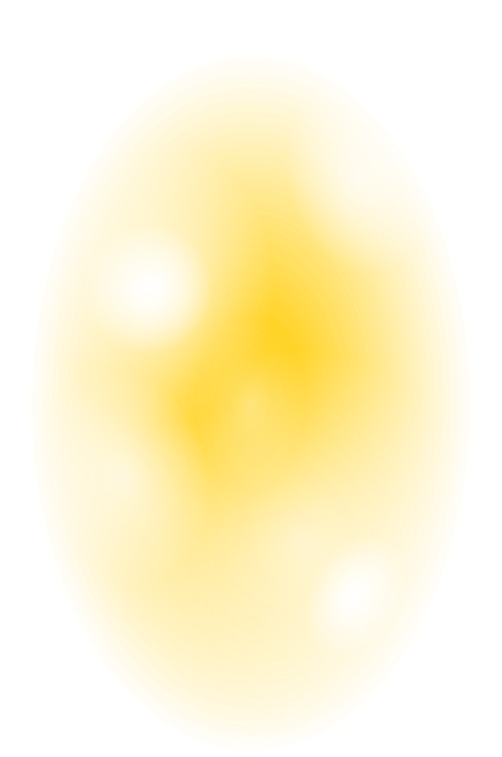

## Les dofus non sorti officiellements
En dehors des dofus ivoire et ébènes implantés dans dofus rétro avec les donjons ilyzaelle et qu'tan, il y a encore d'autres dofus qui ne sont pas utilisés.

## Le dofus cawote 1.0
Avant que le dofus cawotte sorte officiellement avec la version 1.1, il avais une apparence rouge au lieu d'orange:  

## Le dofus des glaces
Un des premiers dofus implanté dans le jeu, il est implanté disponible depuis la version 1.0 du jeu. Il fait partie, avec les dofus emeraude, pourpre, turquoise, cawotte et le vulbis des dofus présents sur le client Dofus 1.0.  
Le voici dans sa version 1:  

Ses bonus supposés:
- 1 à 10% de résistances terre
- 1 à 10% de résistances feu
- 1 à 10% de résistances eau
- 1 à 10% de résistances air
- 1 à 10% de résistances neutre
- 1 à 10 résistances terre
- 1 à 10 résistances feu
- 1 à 10 résistances eau
- 1 à 10 résistances air
- 1 à 10 résistances neutre

On peux supposer que frigost était prévu depuis la sortie du jeu (cf: la baleine du trailer de Dofus en 2004 qui montre une zone gelée), il est étonnant qu'il ne soit pas sorti en version 1.

## Le dofus tâcheté:
Ce dofus peux étrangement être mis en lien avec le dofus ébène et pandala.
Il est présent dans la version 1.13 du jeu mais pas dans la 1.9, il est donc possible qu'il ai été prévu pour pandala, peux être en drop du péki ou un autre monstre de pandala.  
Voici son image:
  

Ses bonus:
- 11 à 20 prospection

On peux imaginer que ce dofus devait être à la place du dofus kaliptus, mais pourquoi n'est-il pas sortis à sa place?  
Comme pour d'autres contenu, la version 1 du jeu a beaucoup de contenu finalement non utilisé, ce qui est surprenant c'est que le dofus kaliptus sorti quelques mois plus tard possède lui des bonus prospection. Ce dofus aurait également permis d'ajouter un interet a aller à pandala en dehors de l'ile de grobe. 
Il semble avoir été ajouté dans les mêmes moments que le dofus ébène, ajouter 2 items intéressants et y ajouter leur background mais ne pas les rendres disponibles est vraiment dommage, surtout que ces versions du jeu avaient besoin d'ajout de contenu intéressant. 

## Le dofus vinaigrette
Dofus un peu plus mystérieux, je n'ai aucune information sur ce dofus en dehors de sa description et de son jet.

Description: Avec ou sans lardons, ce Dofus est toujours aussi bon.

Jet:
- 1 à 3 créatures invocables

## Les autres dofus
Il y a 4 autres dofus mais il n'y a aucune informations sur ceux ci. Il sont apparu après la version 1.16 et dans les moments où le contenu étais présent mais le travail commençais à être déporté vers Dofus 2.0 ce qui à provoquer l'arrêt du développement de ce contenu.

## Supplément
Le dofus ivoire a été intégré avec la version 1.16, en même temps que le dofus kaliptus.  
On peux en supposer que 2 dofus par extension était prévu, par exemple, otomai aurait peux être également du avoir 2 dofus obtenable avec un dofus "majeur" et un dofus "mineur" (comme pour le tacheté et l'ébène avec pandala).